[Home](index.md) | [Manual Assessment Memo](manual_assessment_memo.md) | [Chatbot](chatbot.md) | [Procedure Video](procedure_video.md) | [Manual](manual.md) | [Reflective Blogs](reflective_blogs.md)

# Manual 

# How to Set Up a Firewall using pfSense
- [Introduction](#introduction)
- [Installation](#installation)
- [Initial Configuration](#initial-configuration)
- [Firewall Configuration](#firewall-configuration)
- [Conclusion](#conclusion)

## Introduction

In today's digital age, network security is more important than ever. Whether at home or in a business environment, protecting devices and sensitive data from cyber threats is a top priority. pfSense is an open-source firewall and router platform that provides a flexible and cost-effective way to manage and secure networks.

Developed by Netgate, pfSense is built on FreeBSD, a UNIX-like operating system known for its reliability and performance. It includes a user-friendly web interface that makes complex network configurations accessible even to those without deep technical expertise. pfSense can be installed on dedicated hardware or run in a virtual machine, making it a versatile solution for a wide range of use cases including from home networks and small businesses to large enterprise environments.

At its core, pfSense offers many features such as stateful packet filtering, network address translation (NAT), virtual private network (VPN) support, intrusion detection and prevention, traffic shaping, and captive portals. These features allow users to monitor and control network traffic, defend against unauthorized access, and ensure optimal network performance.

This manual will guide you through the process of setting up pfSense from scratch, including installation, basic configuration, and essential features to get your firewall up and running.

## Installation

First we will look into the installation steps for pfSense. For this guide I will show the steps to install using a virtual machine in VirtualBox. pfSense is very flexible and is able to be installed on another computer/server or can be used as a virtual machine and will have similar set ups.

First, download the latest version of the pfSense ISO image from the official website at https://www.pfsense.org/download/. The software for pfSense is free to use but requires an account to download the latest ISO image. 

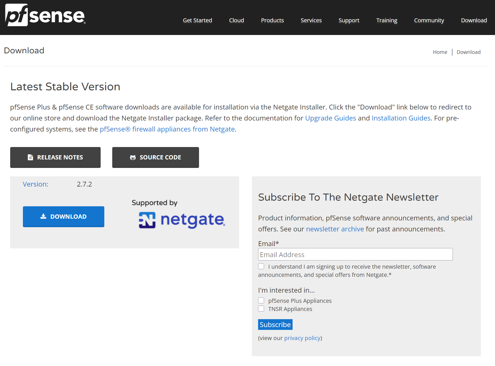

The webpage will look similar to the above screenshot. Click the download button to be transferred to the next page where you will choose the installation image.

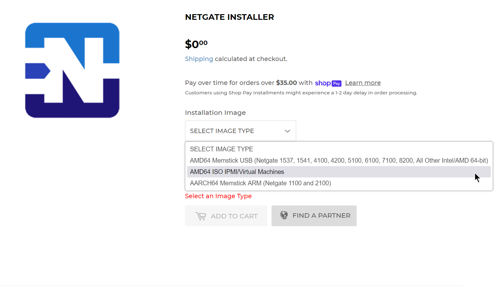

For this guide we are using the image type “AMD64 ISO IPMI/Virtual Machines”. Select the option that best suits your installation type and then click “Add to Cart”. Once added to the cart, you will need to follow the checkout process and either create an account or log in with an existing account. 

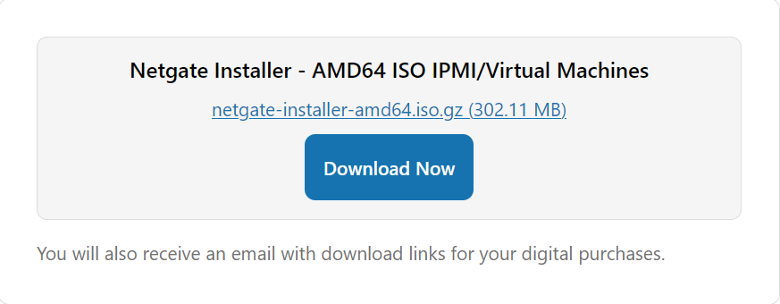

After the checkout process is completed, you be able to click the Download Now button to download the ISO image. Once downloaded, the image is compressed and will need to be uncompressed to use. In Windows , you will need 7zip to extract the ISO file. Open the downloaded file in 7zip then press the “Extract” button as shown in the screenshot below. If you’re using a Linux or macOS computer, the command to unzip the fill is `gunzip <filename>.gz` . This will produce the unzipped ISO file in the same directory the original file was downloaded.

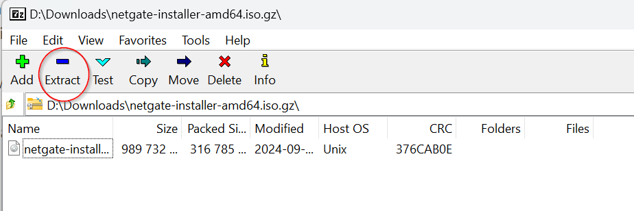

Next, we will mount the pfSense into VirtualBox. Start by clicking the “New” button in VirtualBox. 

Choose the name you want to give the Virtual Machine then under ISO Image choose the .iso file that we decompressed. Everything else can be left as the default values and press “Finish” to create the virtual machine.

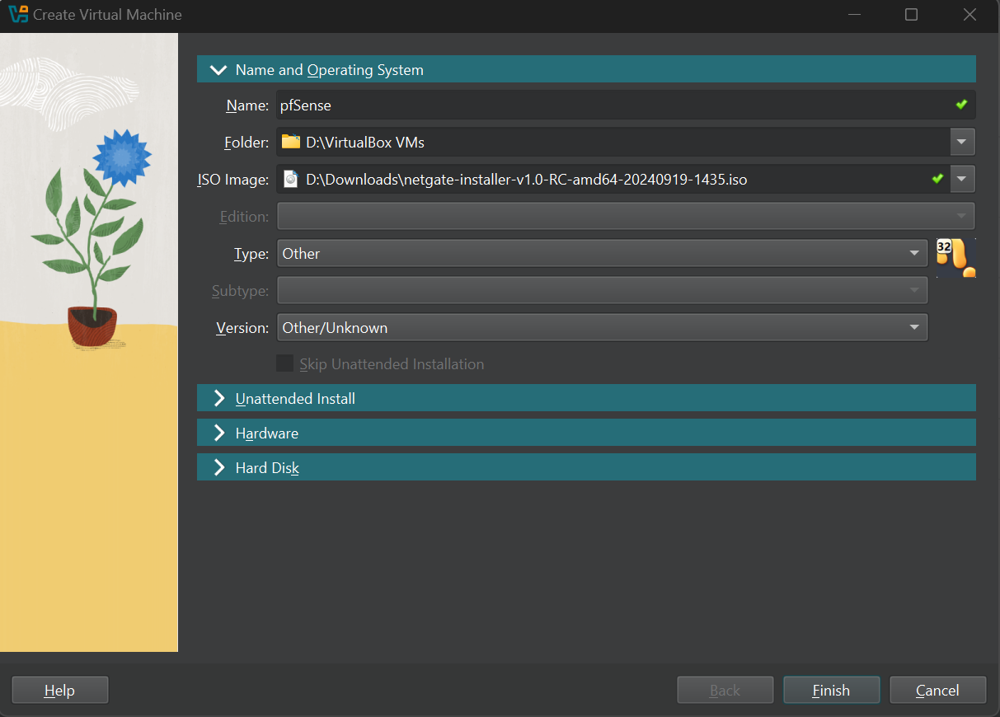

## Initial Configuration

First, boot up the pfSense instance by pressing start on the Virtual Machine. It will go through the initial boot up process then display a “Copyright and Distribution Notice”. 

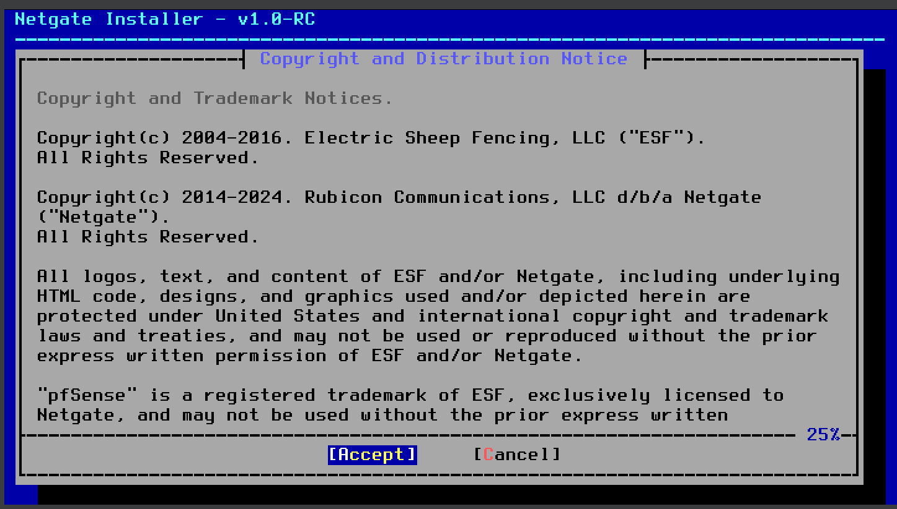

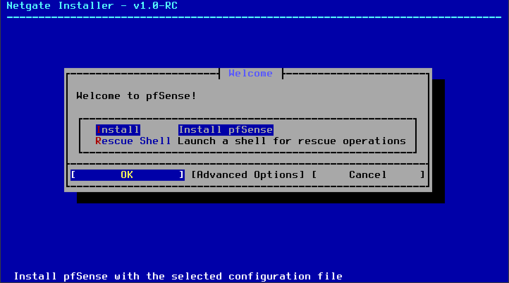

Press the Install button on the Installer page. Choose the default options through the installer. You may be asked to install the CE edition of pfSense due to not having a license. Since we are using pfSense for personal use, we do not need to pay for a license and can choose the CE (Community Edition) of the software. When asked which version to install, choose the stable version. The beta may have issues that can cause problems so we will stay on the most stable version.

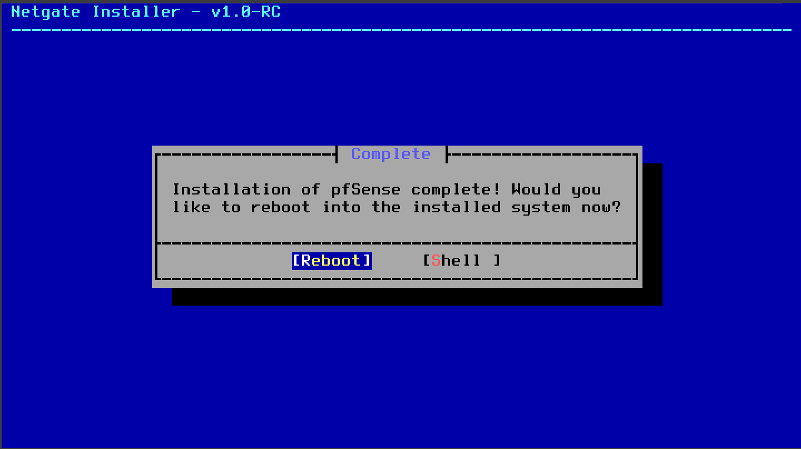

Once the installation has been completed you will reach the screen in the screenshot above. Press Reboot and the Virtual Machine will restart. When it reboots, it will restart the installation of pfSense which we do not want to do again. Close out of the VM and choose to “Power Off” the machine. Next, go into the Settings, choose Storage, select the installer instance and select to “Remove Attachment”.

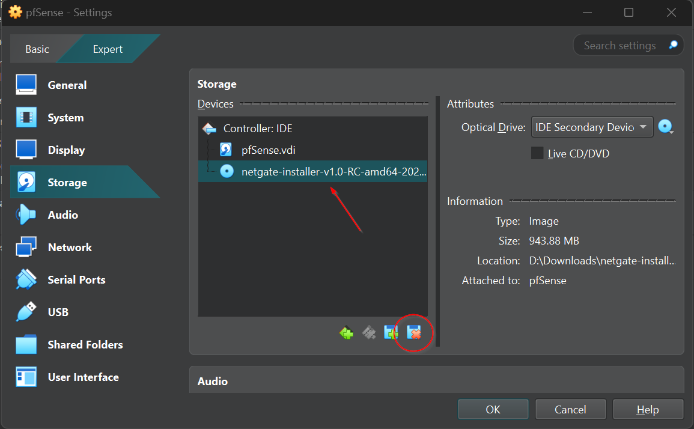

Now boot up the Virtual Machine and pfSense will fully boot. Once you reach the screen shown in the screenshot below, pfSense is now running.

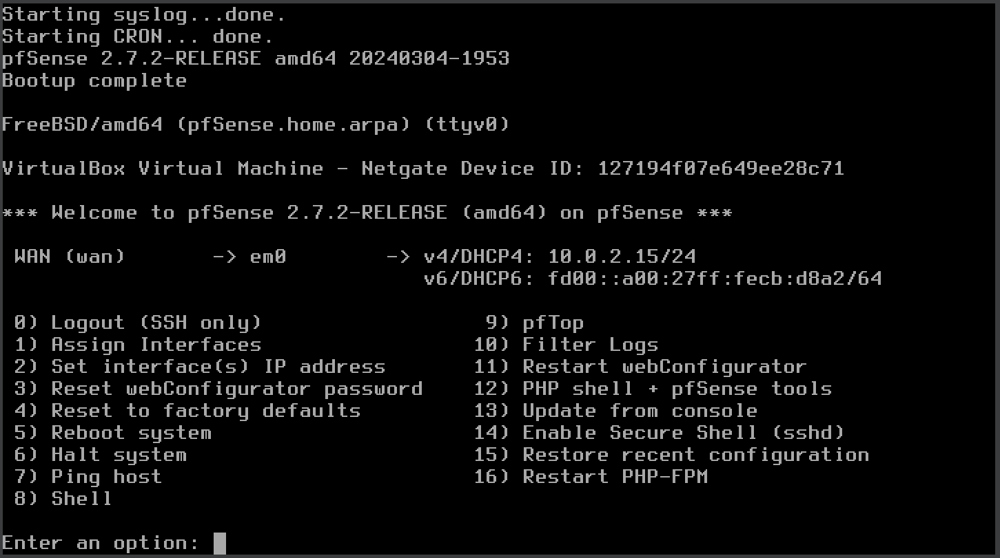

## Firewall Configuration

Now that that pfSense, we can start to configure the instance and use for various functions on our network. To configure the instance, we need to access the webConfigurator from anther machine that is on the same network. To access the webConfigurator, type in the WAN IP address assigned to the pfSense instance in the URL search bar. For instance, the IP address for my pfSense is `10.0.2.15`  but the IP may be different or can be changed.

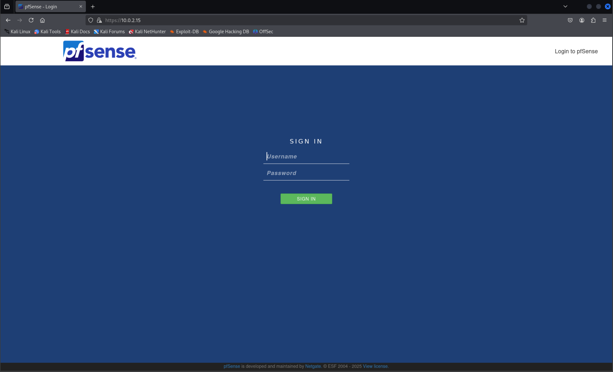

To log in, the default credentials are Username = **admin** & Password = **pfsense**. Once logged in, you will reach the page as shown in the screenshot below. Press next to start the pfSense Setup.

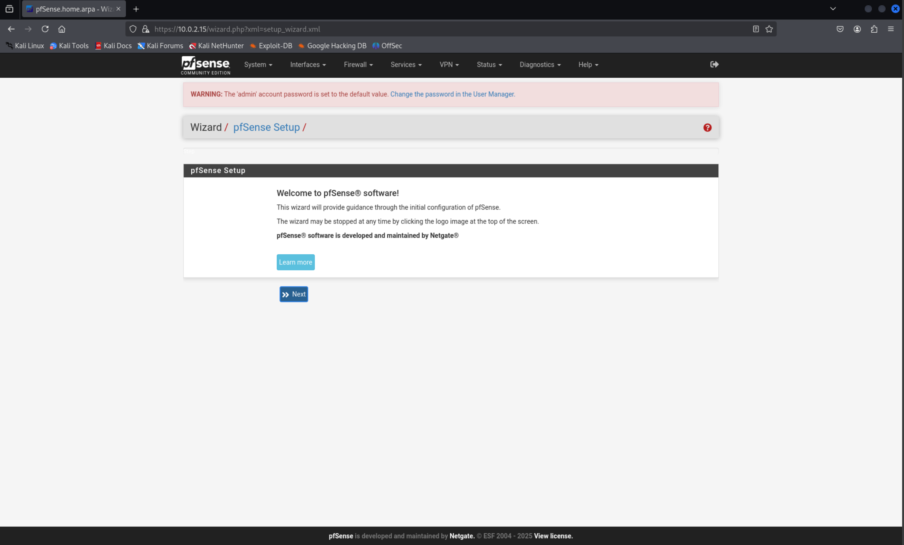

Follow the Setup leaving everything as default and changing the admin password to a password of your choosing. Then select Finish, to complete the setup.

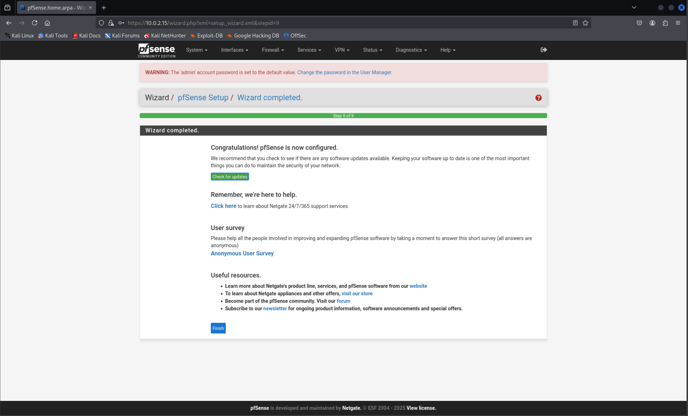

To configure Firewall rules, first select the dropdown menu title “Firewall” at the top of the screen. Then select “Rules” which will bring us to the Firewall Rules page. This page allows us to add different rules, change the order that they should follow, edit and delete other rules. To configure start by pressing the Add button to create a Rule.

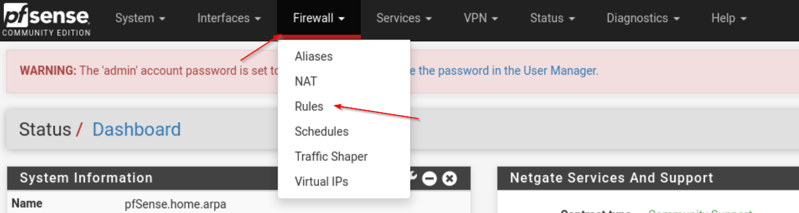

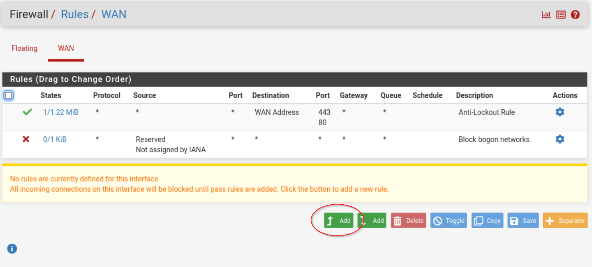

This will bring you to the page to create the rules and edit them. We will be creating a simple firewall rule that allows all HTTPS traffic from inside the network to the outside. This rule essentially allows for secure internet access. Under the “Destination” block, we will choose WAN Address as the Destination and the Destination Port Range we will select HTTPS (443) for both From and To options. If you would like more information on what each option does you can visit the pfSense docs at https://docs.netgate.com/pfsense/en/latest/firewall/configure.html.

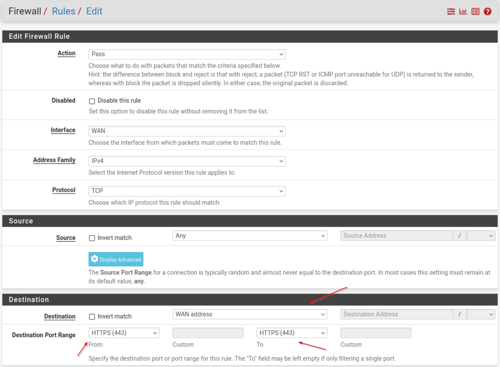

Now that we have the settings configured, we’ll want to give it a name and save the rule. Change the description to what best describes the firewall rule, here I put “Allows All HTTPS Traffic”. Next click the blue “Save” button.

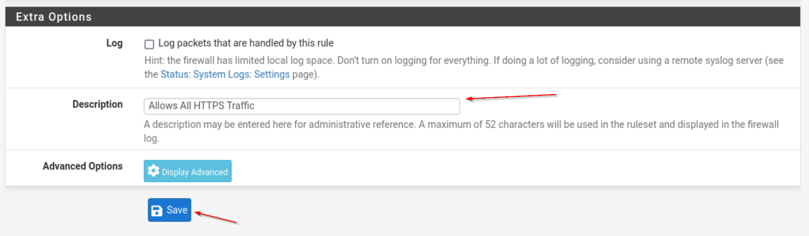

The firewall rule has now been added to our other rules as we can see. We will also need to apply the rule for it to take affect on pfSense. Press the green button labelled “Apply Changes”.

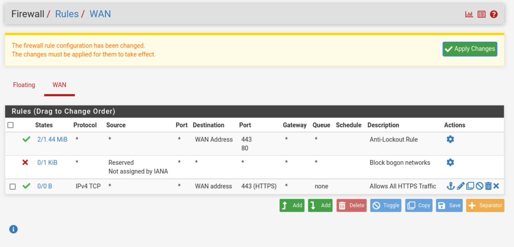

## Conclusion

Setting up a firewall with pfSense may seem daunting at first, but as this guide has shown, it is a manageable and rewarding process. With pfSense, you gain powerful tools to protect your network, control traffic, and ensure secure communication. By following the steps outlined in this manual—from installation to configuring firewall rules—you now have a solid foundation for maintaining a safer and more efficient network. As you become more familiar with pfSense’s features, you can further customize and enhance your firewall to meet your specific needs. Regular updates, monitoring, and thoughtful rule management will ensure your network remains secure and resilient against evolving threats.

**AI Statement:** Google Gemini was used to provide a top-level overview of structuring the manual. ChatGPT 4o was used to edit and provide a conclusion on the manual. Spell check was used to improve the writing on this assignment.
