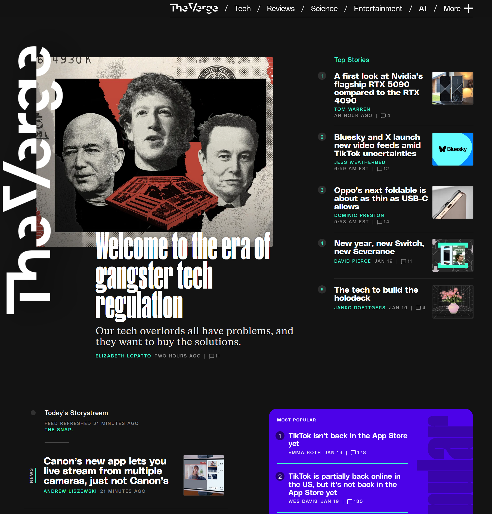

[Home](index.md) | [Manual Assessment Memo](manual_assessment_memo.md) | [Chatbot](chatbot.md) | [Procedure Video](procedure_video.md) | [Manual](manual.md) | [Reflective Blogs](reflective_blogs.md) 

# Table of Contents 
1. [Wayback Analysis](#wayback-analysis)
2. [Quick-Start Guide](#quick-start-guide)
3. [Voyant Analysis](#voyant-analysis)
4. [Manual Assessment](#manual-assessment)
5. [Chatbot Analysis](#chatbot-analysis)
6. [AI Resume Reivision](#ai-resume-revision)
   
# Wayback Analysis
The internet has evolved a lot over the past few years and one major aspect that has seen a big shift is the design and look of websites. Today I will be looking at some of the websites I visit regularly and examine different design details that have changed throughout the years. I’ll also look to understand if websites present today have a broad structure that is followed across multiple different websites.

One website that I visit daily to stay up to date on technology news is [theverge.com](http://theverge.com). The first and most apparent aspect that has changed is the amount of information that is presented when the site is first loaded. One capture from the launch of the news site on November 3rd, 2011, it presents multiple articles in a 3-column grid layout. It includes the headlines and authors of the story but some also include the first few sentences of the article.

Comparing the 2011 version to the present day version of the website is very different as the new design is much cleaner yet still presents the same amount of information. When first loaded the site shows the same number of articles, the headlines, authors, and date/time it was published. There is a lot more spacing between the articles and the layout is a 2-column layout.

Accessing the articles there are also some key differences between the layout of the webpages. The 2011 version has a sidebar that contains latest headlines and media and underneath the text is a gallery carousel for images. Directly below the article is the comments and replies to the article. Comparing this to the present version, there is a lot less on the screen as it focuses mainly on the text of the article. The image carousel is included inside of the article in a way that does not take up as much screen space. The comments for the article are hidden behind a button that needs to be clicked for them to expand. Directly below the article is a short list of articles that are in the same category as the original article.

Another website that I usually often is the popular livestreaming service [twitch.tv](https://twitch.tv). I will comparing the present day version of the website to an archived version from December 2nd, 2011. The current version of the site uses a lot of the screen space, presenting thumbnails for livestreams in a bigger rectangle compared to the 2011 version. The current version also adds a sidebar that includes livestreams of people I follow, recommended streams to watch, and stories. Both sites still have a similar structure of showing carousels of livestreams and having a stream playing at the top when loaded. Other additional information is still present on both versions, such as, viewer count and channel name. The overall information that is presented is similar with a lot of differences being in the design of the site and the utilization of elements like gradients and shadows.

Overall, the design of sites have changed quite a lot in the past few years with the designs of sites constantly evolving and changing to meet the different needs of its users. One aspect that has changed over the decade is the growth of smartphones and people accessing websites from their phone. This required sites to design versions of their sites that are compatible for the screens of a smartphone. Another change has been the design language has been moving towards are more minimal and simple look. Many websites feel more flat and show the most important information more prominently.

**AI Statement**: This blog does not include artificial intelligence written language.

# Quick-Start Guide
I will show you how to set up a turntable to start listening to vinyls. I will be using the [Audio-Technica AT-LP60X Turntable](https://a.co/d/71KZdZP) for this guide. You will need some other equipment like a pair of speakers that supports an RCA connetion and a vinyl.

1. First, take out everything that comes in the box. This will include the turntable, an RCA output cable, DC power cable, and a removable hinged dust cover.
   
 
 
   
Figure 1. Turntable

   

  
   
Figure 2. DC Power Cable (Left) and RCA Output Cable (Right)

2. **Connect** all the wires for the turntable. We’ll start by plugging the 3.5mm jack (Shown in figure 4) on the RCA output cable into the ‘ANALOG OUT’ port on the back of the turntable (Figure 3). Plug the other end of the RCA output cable into to the plugs on the speaker.
   

   
Figure 3. Back of Turntable

   

   
Figure 4. 3.5mm Headphone Jack

3. **Plug** the DC barrel into the ‘DC IN 12V’ port on the back of the turntable (Figure 3) and the other end into an available power outlet.
4. Now the turntable is connected to the speakers and has power. To use the removable dust cover, place the hinges into the slots on the back of the turntable. Place the slip mat onto the turntable, then place the vinyl on top of the slip mat.
5. **Adjust** the record size on the turntable using the switch and the speed using the button that correlates to your vinyl. Most album vinyls will be 12” in size and spin at 33 rotations per minute speed. 

**AI Statement**: This blog does not include artificial intelligence written language.

# Voyant Analysis
Use [Voyant](https://voyant-tools.org/) to analyze a manual, website, or other large body of text. What words are used the most? What can this software tell you about a piece of writing?

I used the manual to the [MSI Z390-A Pro Motherboard](https://download-2.msi.com/archive/mnu_exe/mb/E7B98v1.2.pdf) in Voyant to analyze the text. The software helps to analyze text and find patterns and insight on a piece of text. Some of the words that were used the most were BIOS at 143 uses, power with 115 uses, and intel with 106 uses. The software is able to examine words and phrases that are the most used in a document and creates multiple types of graphics for it. One graph shows trends of where the most common words are used in segments of the document. This could be used to find parts of the document that focus on the word that you are looking for. One instance for the motherboard manual is in the 4th segment is where a majority of the word BIOS is used, meaning that part of the document has information about the BIOS and probably how to use it and explains what many of the options do. Another feature of the site is the links bubble map, which shows the most common terms and links it to other words that are used with the term. Voyant can be very helpful on understanding a document and the patterns/structure of the piece of text.

**AI Statement**: Only spell check was used to improve the writing on this assignment.

# Manual Assessment
Prompt: Explore an online tutorial, manual, or reference guide/FAQ page. Give it an honest but professional assessment. Describe in your post the aspects of the page(s) that are effective, and explain why. Describe the aspects of the page(s) that are ineffective, and explain why.

I will be providing an assessment on the [Volkswagen Jetta 2023 Owners Manual](https://www.manua.ls/volkswagen/jetta-2023/manual). Some of the aspects that are effective for the manual is the use of icons and imagery to help visualize parts of the manual. The inclusion of icons that are colored help to bring attention to important information, such as, a red caution symbol next to text that explains dangers and how to be safe. The images in the manual are used to show what certain buttons and other parts of the car do. Some aspects of the manual that could be changed is adding additional information on functions/accessories that are optional upgrades or only available on certain trims. It could be easy for a reader to believe they have a function that is explained in the manual but is not available on their car.

**AI Statement**: Only spell check was used to improve the writing on this assignment.

# Chatbot Analysis
Prompt: Analyze a chatbot. Spend at least 5 minutes interacting with it & exploring its functionality. Then, reflect on the bot's: **purpose, functionality**, **user experience**, and **context**

I spoke with the [Movie Critic Bot](https://box.boodle.ai/a/role-moviecritic) from BoodleBox. The purpose of the bot is to discuss movies with the user, explaining the themes and plots behind each film. The chatbot functions exactly how it is described and provides examples of movies and then discusses the movie and providing its thoughts and take aways from the movie. The chat bot was very easy to use, one thing that made it easy to talk with it is it provided additional questions for me at the end of each of its responses. This allowed me and the bot to continue talking about different movies, what we enjoyed about them, the themes, and providing me with additional movies to watch. Talking with the bot has provided me with new movies to watch that it believes I would enjoy based off my favorite movies and why I like the movies.

**AI Statement**: Only spell check was used to improve the writing on this assignment.

# AI Resume Revision
Prompt: Upload your resume (without your address, phone number, and email) to a generative AI tool of your choice. Ask it what position you are best suited for, then ask it to revise your resume to make it more appealing to a future employer in your ideal field. **Post:** A summary of the suggested changes and a reflection. What did it do? What did you learn? 

I uploaded my resume to Claude 3.7 Sonnet and asked which position suited me best based on my resume. The response was positions in network operations and IT infrastructure management. I then asked it to revise my resume for network operation and cybersecurity analyst positions. Some of the changes it made to my resume include rewriting the professional summary to focus on security and troubleshooting abilities. Claude also strengthened my job descriptions by adding quantifiable statistics and also included specific wording for security focused jobs. It also recommended adding a projects and additional experience section that could include any cybersecurity capture the flag competitions or home projects. Some things I learned from the AI is to add specific wording and details that are specific to the job role I am looking to achieve. In the case of my resume it added security specific and network operation skills and responsibilities.

**AI Statement**: Claude 3.7 Sonnet was used during the assignment to revise my resume. Spell check was used to improve the writing on this assignment.
