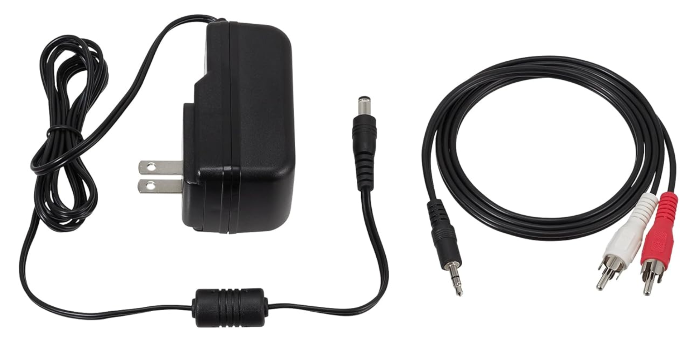

[Home](index.md) | [Manual Assessment Memo](manual_assessment_memo.md) | [Chatbot](chatbot.md) | [Procedure Video](procedure_video.md) | [Manual](manual.md) | [Reflective Blogs](reflective_blogs.md) 

# Table of Contents 
1. [Wayback Analysis](#wayback-analysis)
2. [Quick-Start Guide](#quick-start-guide)
   
# Wayback Analysis
The internet has evolved a lot over the past few years and one major aspect that has seen a big shift is the design and look of websites. Today I will be looking at some of the websites I visit regularly and examine different design details that have changed throughout the years. I’ll also look to understand if websites present today have a broad structure that is followed across multiple different websites.

One website that I visit daily to stay up to date on technology news is [theverge.com](http://theverge.com). The first and most apparent aspect that has changed is the amount of information that is presented when the site is first loaded. One capture from the launch of the news site on November 3rd, 2011, it presents multiple articles in a 3-column grid layout. It includes the headlines and authors of the story but some also include the first few sentences of the article.

Comparing the 2011 version to the present day version of the website is very different as the new design is much cleaner yet still presents the same amount of information. When first loaded the site shows the same number of articles, the headlines, authors, and date/time it was published. There is a lot more spacing between the articles and the layout is a 2-column layout.

Accessing the articles there are also some key differences between the layout of the webpages. The 2011 version has a sidebar that contains latest headlines and media and underneath the text is a gallery carousel for images. Directly below the article is the comments and replies to the article. Comparing this to the present version, there is a lot less on the screen as it focuses mainly on the text of the article. The image carousel is included inside of the article in a way that does not take up as much screen space. The comments for the article are hidden behind a button that needs to be clicked for them to expand. Directly below the article is a short list of articles that are in the same category as the original article.

Another website that I usually often is the popular livestreaming service [twitch.tv](https://twitch.tv). I will comparing the present day version of the website to an archived version from December 2nd, 2011. The current version of the site uses a lot of the screen space, presenting thumbnails for livestreams in a bigger rectangle compared to the 2011 version. The current version also adds a sidebar that includes livestreams of people I follow, recommended streams to watch, and stories. Both sites still have a similar structure of showing carousels of livestreams and having a stream playing at the top when loaded. Other additional information is still present on both versions, such as, viewer count and channel name. The overall information that is presented is similar with a lot of differences being in the design of the site and the utilization of elements like gradients and shadows.

Overall, the design of sites have changed quite a lot in the past few years with the designs of sites constantly evolving and changing to meet the different needs of its users. One aspect that has changed over the decade is the growth of smartphones and people accessing websites from their phone. This required sites to design versions of their sites that are compatible for the screens of a smartphone. Another change has been the design language has been moving towards are more minimal and simple look. Many websites feel more flat and show the most important information more prominently.

# Quick-Start Guide
To use the Audio-Technica AT-LP60X Turntable, you will need some other equipment like a pair of speakers and a vinyl.

1. First, take out everything that comes in the box. This will include the turntable, an RCA output cable, DC power cable, and a removable hinged dust cover.

 
 

Figure 1. Turntable

   

  

Figure 2. DC Power Cable (Left) and RCA Output Cable (Right)

   
2. Connect all the wires for the turntable. We’ll start by plugging the 3.5mm jack (Shown in figure 4) on the RCA output cable into the ‘ANALOG OUT’ port on the back of the turntable (Figure 3). Plug the other end of the RCA output cable into to the plugs on the speaker.

Figure 3. Back of Turntable

Figure 4. 3.5mm Headphone Jack

3. Plug the DC barrel into the ‘DC IN 12V’ port on the back of the turntable (Figure 3) and the other end into an available power outlet.
   
4. Now the turntable is connected to the speakers and has power. To use the removable dust cover, place the hinges into the slots on the back of the turntable. Place the slip mat onto the turntable, then place the vinyl on top of the slip mat.

5. Adjust the record size on the turntable using the switch and the speed using the button that correlates to your vinyl. Most album vinyls will be 12” in size and spin at 33 rotations per minute speed. 
